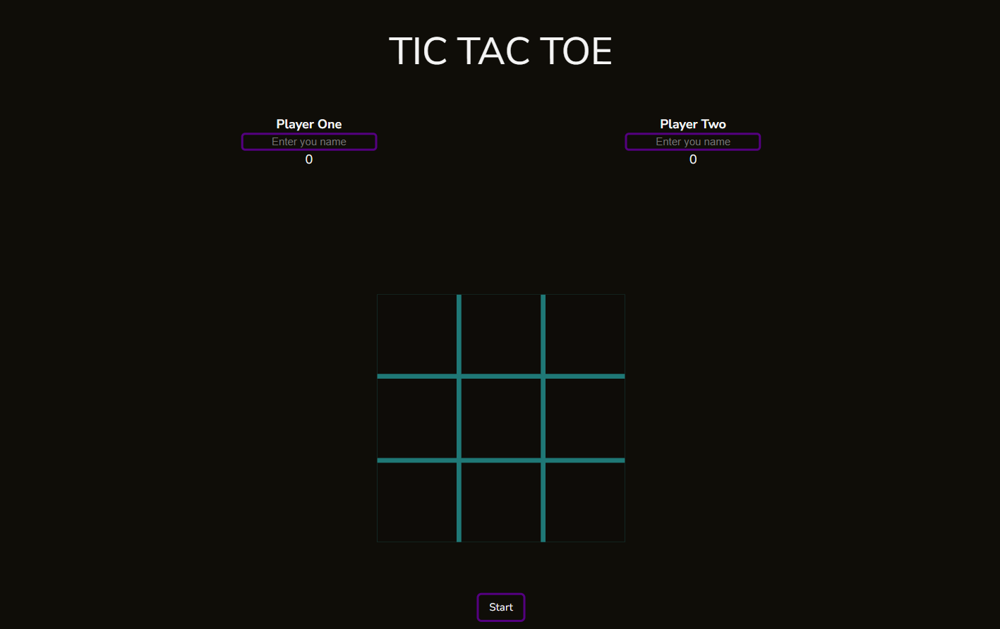
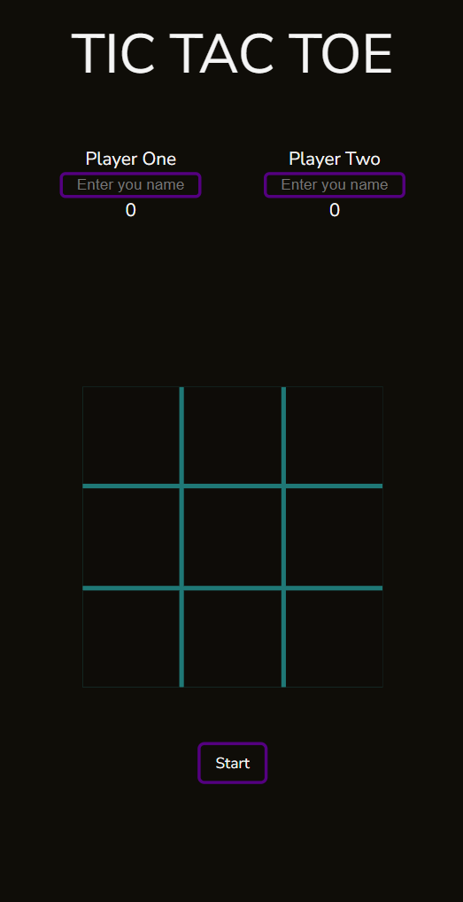

# Tic Tac Toe Game

## 🔗 [Live Demo](https://orianaland.github.io/Tic-Tac-Toe/)

  
  


## Description

A responsive Tic Tac Toe game built with JavaScript as part of [The Odin Project](https://www.theodinproject.com/) curriculum. This implementation features player customization, score tracking, and sleek animations with a dark mode aesthetic.

## Features

- **Player Customization**: Name your players for personalized gameplay
- **Score Tracking**: Wins are recorded across multiple rounds
- **Game States**:
  - Turn indicators
  - Win/tie announcements
  - Game over handling
- **Visual Effects**:
  - Glitch text animation
  - Neon player markers (X/O)
  - Smooth hover and click animations
- **Responsive Design**: Adapts to both mobile and desktop screens
- **Game Controls**:
  - Start new game
  - Reset current board
  - Full game reset

## Technologies Used

- **HTML5**: Semantic structure
- **CSS3**:
  - CSS Grid for board layout
  - Custom properties (CSS variables)
  - Complex keyframe animations
  - Media queries for responsiveness
- **JavaScript**:
  - Module pattern for game logic
  - Factory functions for game cells
  - Event delegation
- **Google Fonts**: Nunito Sans for clean typography

## Live Demo

[Play Tic Tac Toe Now](https://orianaland.github.io/Tic-Tac-Toe/)

## Screenshots

### Desktop View



### Mobile View



## Installation

To run locally:

```bash
git clone https://github.com/orianaland/Tic-Tac-Toe.git
cd Tic-Tac-Toe
open index.html# Tic-Tac-Toe
```
